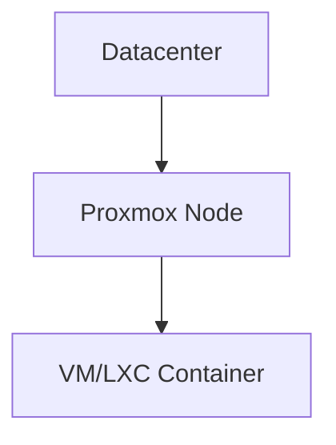

# Proxmox Firewall

<figure markdown="span">
Es gibt drei Firewall Ebenen:

</figure>
## Firewall Ebene Datacenter
Auf Level Datacenter müssen 3 Firewall Regeln erstellt werden, bevor die Firewall im Menüpunkt Otions eingeschaltet wird:

<figure markdown="span">
  { width="750" }
  <figcaption>Management Port Proxmox erlauben</figcaption>
</figure>
!!!warning "Interface"

    Vorher im Proxmox Node prüfen welches das Standard Interface mit der IP Adresse aus dem LAN ist und diese Bridge einsetzen. Normalerweise sollte dies vmbr0 sein.

<figure markdown="span">
  { width="750" }
  <figcaption>DHCP Anfragen erlauben</figcaption>
</figure>

<figure markdown="span">
  { width="750" }
  <figcaption>DNS Anfragen erlauben</figcaption>
</figure>

!!! info "Firewall aktivieren"

    Im Datacenter unter Firewall im Sub-Menü Options kann die Firewall aktiviert werden.

### Aliase erstellen

Auf Level Datacenter noch Aliase erfassen:
<figure markdown="span">
  { width="750" }
  <figcaption>Alias erfassen</figcaption>
</figure>
Nachfolgend einige nützliches Aiase:
<figure markdown="span">
  { width="750" }
  <figcaption>Übersicht nützlicher Aliase</figcaption>
</figure>

### Security-Group erstellen

Auf Level Datacenter noch eine Security-Group local-network erstellen. Mit dieser Security Group soll dem Node die Komminikation im LAN ermöglicht werden.

Zudem eine Secuirty Group "virtual-network" estellen. Dort kommen alle Firewall Regln für die VM's resp. LXC Container hinein.

## Firewall auf Ebene Proxmox Node

## Firewall auf Ebene VM/LXC Container

Auf Datacenter Ebene eine Secuirty Group "virutal-network" ersellen. In dieser Gruppe die Firewall Regeln defnieren, welche auf die VM's resp. LXC Container angewendet weden soll.

Basic Regel:
Inbound:

- Drop all form alias local-net
- Allow SSH Macro from virtual-net
- Allow all from virtual-net

Outbound:

- allow destination is virutal-net
- allow destinaction is gateway
- allow destination is nas
- Drop all to local-net
